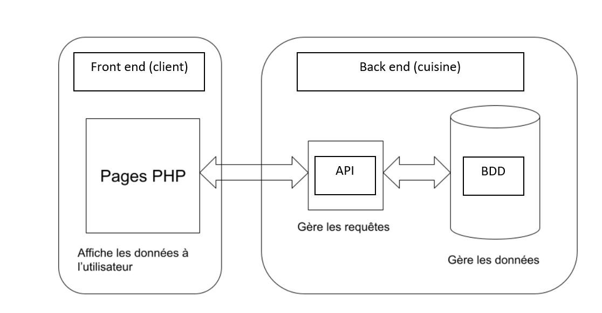
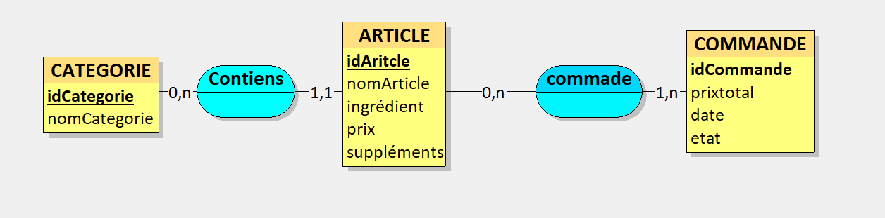
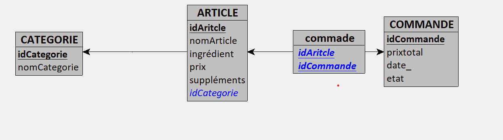
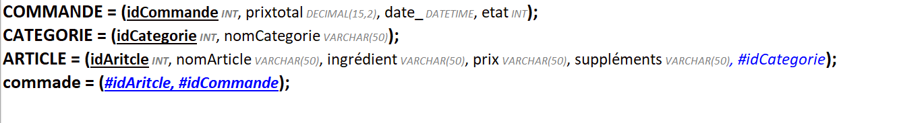

# **Projet : EatSmart**

**Etudiant :** COSTAMAGNA Mathieu

---

### **1. Description du projet**

Le projet à pour but d'établir une liaison entre client et cuisine afin de prendre les commandes des clients et de les commnuniqué en cuisine. 

---

### **3. Fonctionnalités principales**

#### **3.1 Frontend (eatSmartFront)**

- **Fonctionnalité 1 :**
  Programmation du menu 
  
- **Fonctionnalité 2 :**  
  Gestion du menu
  
#### **3.2 Backend (eatSmartBack)**

- **Fonctionnalité 1 :**  
  Gestion de l'état de la commande
  
- **Fonctionnalité 2 :**  
  historique de commande

---

### **4. Technologies utilisées**

- **Frontend :** HTML/CSS/JS/PHP
- **Backend :** PHP
- **Base de données :** SQL

---

